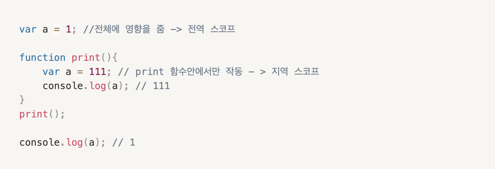
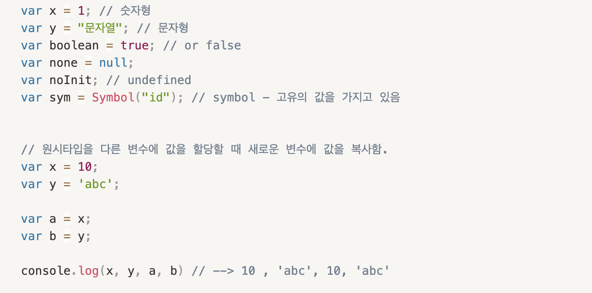
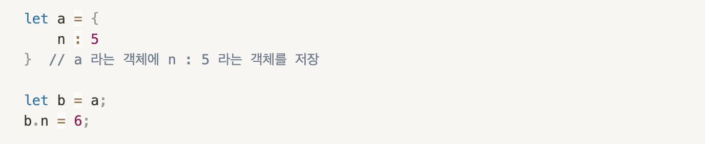
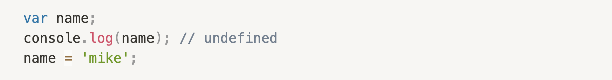
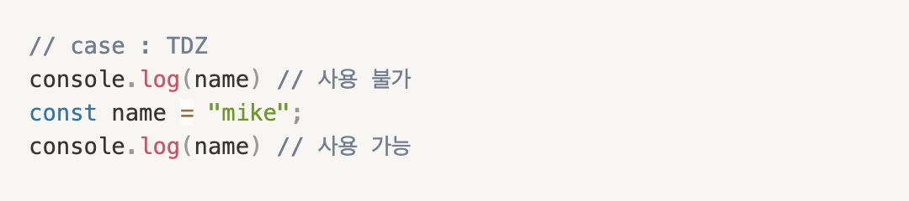

# javascript ES6 신문법 & 객체지향 라이브러리
ES6 에서 추가된 기본적인 문법을 다루고, 자바스크립트만의 동작원리를 파악하여 
스크립트만의 데이터 타입부터 동기 / 비동기 처리같은 문법을 학습하여 
각 상황에 맞는 코드를 작성하기 위해 스크립트 라이브러리를 업로드 하였습니다.

<h1>1. Scope</h1>

<ul>
    <li>
        스코프란? 영역 또는 범위 라는 뜻입니다. 프로그래밍 언어에서의 스코프는 변수와 
        매개변수의 접근성, 생존기간을 의미합니다.  
        스코프에는 두가지 타입이 존재하는데 Global Scope, Local Scope 입니다.
         
         
        
         
         
        print 함수안에 있는 콘솔은 111이 나오는것을 확인 할 수 있습니다. 만약 print 안에 a 라는 변수가 
        없다면? 콘솔에는 1이 출력 될 것 입니다 
        하지만 ES6에서부터 let / const 가 추가 됨으로써 지역변수를 선언 할 때 좀 더 편리하고,유지보수가 용이 하다는 장점이 있기때문에  var 키워드의 사용은 지양하는편이 좋습니다.
    </li>
</ul>

<h1>2-1. 원시 데이터 타입</h1>
<ul>
    <li>
        데이터 타입에는 크게 원시형과 참조형 데이터 타입으로 나눌수 있는데 
        참조형과는 달리 값을 공유하는 것이 아닌 복사의 개념입니다.
    </li>
</ul>
 
 

 
 

<h1>2-2. 참조형 데이터 타입</h1>
<ul>
    <li>
        객체, 배열, 함수 와 같은 타입들은 참조 될 수 있다고 하는데, 
        이러한 참조형 데이터들은 위의 원시형 데이터와는 다르게 변할수 있는 데이터 입니다.   
        어디서 변할지 모르기 때문에 신경을 써야 합니다.
         
         
        
         
         
        객체를 생성하면 a 는 주소 어딘가에 저장이 됩니다. 
        그 후에 b 에 a 를 대입합니다 . 이렇게  하면 b 는 a 와 같은 주소를 참조(값을 공유)하게 되는것입니다, 
        이후에 b 의 n 의 값을 6으로 바꾸고 a 를 출력하면 n 의 값이 6으로 바뀐것을 확인 할 수 있습니다. a의 값이 바뀐것은 둘다 같은 주소를 참조 하기 때문입니다.
    </li>
</ul>

<h1>3. 호이스팅</h1>
<ul>
    <li>
        호이스팅이란,스코프 내부 어디에 있던지 변수 선언은 최상위에 선언 된것처럼 행동하는 것입니다. 
        변수 선언을 할 때 사용하는 let , const , var중에 var는 선언하기전 값을 할당하고 , 선언후 재할당도 가능한 특성이 있습니다.
         
         
        
         
         
        위의 코드에서 선언후 값을 할당하지 않으면 undefined를 출력합니다. 이유는 
        3번째의 name은 상단으로 움직이긴 하지만, 할당된 값은 움직이지 않기 때문입니다. 
        let 과 const의 경우에는 Reference Error를 발생시키는데 var 처럼 동작하지 않는 이유를 보면,
         
         
        
         
         
        TDZ 라는 영역 때문입니다. 스크립트를 위에서부터 한줄씩 처리할 때, 처음 콘솔의 경우 
        이 영역에 해당되기 때문에 에러를 발생시킵니다. 
        var 의 경우 함수단위로 스코프를 적용하고 나머지 스코프에서는 전역적으로 영향을 주기때문에 
        ES6에서 추가된 let , const를 사용하여 예측가능한 코드를 작성함으로써 오류를 줄일수 있도록 하는것이
        바람직한 방법입니다.
    </li>
</ul>